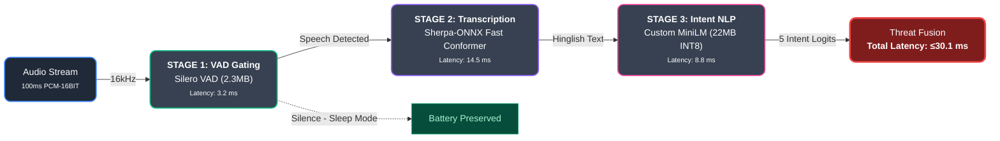

# CyberGuard AI - On-Device Telecom Defense against Social Engineering

  
  
  
  

## The Problem

In 2024, India lost over ₹1,900 Crore to "digital arrest," voice phishing, and social engineering scams. Current telecom defenses rely heavily on reactive cloud-based lookups and user reports. These legacy systems fail against spoofed VoIP numbers and zero-day attack scripts. Furthermore, when vulnerable citizens—especially the elderly—are placed under psychological pressure by scammers posing as law enforcement, they enter a panic loop and become physically incapable of hanging up the phone.

## The Solution

**CyberGuard AI** is a proactive, real-time telecom defense system that operates entirely on the edge. Rather than simply blocking known numbers, it analyzes the behavioral psychology and intent of the live conversation. 

When a scammer utilizes coercion, false authority, or extreme urgency, the AI instantly detects the threat. To break the victim's panic loop, the system intervenes autonomously by flashing a full-screen RED warning overlay, vibrating the device, and instantly dispatching a "Guardian SMS" to trusted family members with the caller's details.

## Core Technology & Architecture

Engineered to run efficiently on low-cost 5G Android smartphones (tested on ₹12K Oppo A59 5G), CyberGuard AI utilizes a proprietary **Tri-Fold Asynchronous AI Gating Pipeline**:

*   **Stage 1 (VAD Gating):** A lightweight Voice Activity Detection model (Silero VAD) gates the CPU, preserving battery and preventing thermal throttling by sleeping during silence.
*   **Stage 2 (ASR):** Speech is transcribed into Hinglish text in 100ms chunks using a highly optimized Sherpa-ONNX Fast Conformer.
*   **Stage 3 (Intent NLP):** A custom 22MB INT8-quantized MiniLM model, fine-tuned via Layer-Wise Learning Rate Decay, processes the transcript. It uses a bespoke 5-neuron classification head to score the call across distinct psychological vectors (Financial, Urgency, Coercion, Intimacy, Trust).

By shifting computation entirely to the device, the system achieves an end-to-end pipeline latency of **≤30.1 ms**—well within the telecom budget for real-time intervention.

### Pipeline Flow

## Swarm Intelligence & 5G Infrastructure

CyberGuard AI is designed as a B2B2G (Business-to-Business-to-Government) infrastructure solution. 

When a threat is detected, it generates an ultra-compact **82-bit binary telemetry packet** (just 10.25 bytes). This packet transmits anonymous threat signals to a Go-based Swarm Server via a 5G URLLC network slice. The server utilizes a 10M-bit Bloom Filter for O(1) instant threat lookups across the national network, essentially immunizing the entire grid against a scammer within seconds of their first call. 

Additionally, a persistent **72-bit ContactMemory state machine** tracks multi-session conversational arcs, effectively defending against slow-burn "pig butchering" and romance scams.

## Privacy by Design

Because all AI processing happens locally on the smartphone, **zero bytes of raw audio or transcript data ever leave the device.** Only anonymized risk scores are shared with the network. The proprietary local neural network weights are secured by "The Vault"—a multi-layered defense architecture utilizing AES-256-GCM encryption, Android Keystore, and NDK XOR salts.

## Achievements & Project Status

*   **Top 50 Proposal:** Selected as one of the Top 50 proposals nationwide in the 5G Innovation Hackathon.
*   **Seed Funding:** Granted official prototype development seed funding.
*   **IMC 2026 Showcase:** Awarded an exclusive startup stall at the prestigious India Mobile Congress (IMC) 2026 ASPIRE Pavilion.

This project is a prototype-validated blueprint for securing telecom networks against social engineering.

*Built by Dilip Sahu - Founder & AI Architect*
