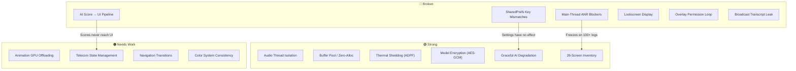

# 📊 CyberGuard AI — Critical Performance Scorecard & Architectural Audit

**Audited By:** 4 Specialized AI Auditors (Compose Performance, Edge AI Pipeline, Backend Systems, UI/UX Design)  
**Codebase Size:** ~20,000+ lines across 50+ Kotlin files  
**Date:** 2026-09-14

---

## Overall Score: 6.1 / 10

````carousel
### 1. Core Architecture & Jetpack Compose Performance
# Rating: 5.0 / 10

| Sub-Category | Grade |
|---|---|
| `remember` / `derivedStateOf` usage |  Poor |
| `graphicsLayer` GPU offloading |  Mixed |
| `key` in Lazy layouts |  Critical |
| Main-thread blocking |  Severe ANR Risk |
| State hoisting / ViewModel coverage |  High Leakage |
| Animation implementations | 🟢 Good |
<!-- slide -->
### 2. Edge AI & Pipeline Engineering
# Rating: 7.5 / 10

| Sub-Category | Grade |
|---|---|
| Thread isolation (Audio/AI/DB) | 🟢 Excellent |
| Memory management & buffer pooling | 🟢 Good (with caveats) |
| Lifecycle management (ONNX/AudioRecord) |  Double-free risk |
| State emission to UI |  Broken link |
| Error handling & graceful degradation | 🟢 Good |
| Thermal management (ADPF) | 🟢 Excellent |
<!-- slide -->
### 3. Backend & Core System Integration
# Rating: 4.5 / 10

| Sub-Category | Grade |
|---|---|
| Room Database architecture |  Dual DB fragmentation |
| Telecom InCallService |  Memory leaks & race conditions |
| Navigation graph |  Broken backstacks |
| SharedPreferences consistency |  Key/type mismatches |
| Permissions & Manifest |  Missing critical permissions |
| Broadcast security |  Transcript leaking |
<!-- slide -->
### 4. UI/UX, Motion & Human Interface Design
# Rating: 7.5 / 10

| Sub-Category | Grade |
|---|---|
| Visual hierarchy & color system |  Inconsistent tokens |
| Screen inventory (26 screens) | 🟢 Comprehensive |
| Animation quality | 🟢 Good foundation |
| Cognitive load during calls | 🟢 Well-contained |
| Interactive elements & touch targets |  Missing haptics |
| Dark mode & theming |  Completely broken |
| Accessibility (WCAG) |  Contrast failures |
````

---

## 🔍 QUANTITATIVE ANALYSIS & OBSERVATIONS

### Category 1: Core Architecture & Compose Performance (5.0/10)

The Compose layer has pockets of excellence but is undermined by systemic architectural violations.

#### 🟢 What's Done Right
- **`ActiveCallScreen.kt`**: Proper `rememberUpdatedState` for callbacks (L116-118), GPU-offloaded pulsing dot via `graphicsLayer { this.alpha = alpha }` (L193), and clean `AnimatedVisibility` transitions for captions/notes (L347-365).
- **`BlinketSliderScreen.kt`**: Gold-standard `graphicsLayer` lambda implementation (L81-95) — scale and alpha calculated entirely in the Draw phase.
- **`SwipeToAnswerSlider`**: Uses lambda `.offset { IntOffset(...) }` (L528) avoiding recomposition, with proper spring physics (`DampingRatioMediumBouncy`, `StiffnessLow`).
- **Progress indicators**: `LinearProgressIndicator(progress = { ... })` lambda pattern used correctly across `SplashScreen`, `DashboardScreen`, and `PostCallReviewScreen`.

####  Critical Failures

**1. Main-Thread ANR Blockers (Severity: P0)**

> [!CAUTION]
> Multiple screens execute **synchronous SQLite ContentResolver queries on the Main thread during Compose `remember` evaluation**, guaranteeing ANR on devices with 100+ call logs.

| File | Line | Blocking Operation |
|---|---|---|
| [CallLogsScreen.kt](file:///home/dilip_sahu/5ghack/cyberguard-ai-app/app/src/main/java/com/example/ui/CallLogsScreen.kt#L38-L57) | 38-57, 95 | `lookupContactName()` runs N synchronous `contentResolver.query()` calls inside `remember` for every call log |
| [FavoritesScreen.kt](file:///home/dilip_sahu/5ghack/cyberguard-ai-app/app/src/main/java/com/example/ui/FavoritesScreen.kt#L33) | 33 | `getFavoriteContacts()` blocks Main thread in `remember` init |
| [VoicemailScreen.kt](file:///home/dilip_sahu/5ghack/cyberguard-ai-app/app/src/main/java/com/example/ui/VoicemailScreen.kt#L31) | 31 | `getVoicemails()` blocks Main thread in `remember` init |
| [ContactDetailScreen.kt](file:///home/dilip_sahu/5ghack/cyberguard-ai-app/app/src/main/java/com/example/ui/ContactDetailScreen.kt#L280) | 280 | `contentResolver.update()` in button `onClick` |
| [IncomingCallActivity.kt](file:///home/dilip_sahu/5ghack/cyberguard-ai-app/app/src/main/java/com/example/IncomingCallActivity.kt#L336-L350) | 336-350 | `LaunchedEffect` runs ContentResolver on Main dispatcher |

**2. Missing `key` Parameters in Lazy Lists (Severity: P1)**

9 out of 12 lazy lists lack `key` parameters, causing scroll jank, state desync, and unnecessary recomposition:

| File | Line | Issue |
|---|---|---|
| [AllContactsScreen.kt](file:///home/dilip_sahu/5ghack/cyberguard-ai-app/app/src/main/java/com/example/ui/AllContactsScreen.kt#L162) | 162 | `key = { it.id }` **crashes** — duplicate keys when contacts have multiple numbers |
| [ScamHistoryScreen.kt](file:///home/dilip_sahu/5ghack/cyberguard-ai-app/app/src/main/java/com/example/ui/ScamHistoryScreen.kt#L81) | 81 | `key = { it.phoneNumber }` crashes on repeat scam calls from same number |
| BlockedNumbersScreen, CallDetailScreen, CallRecordingsScreen, CreateEditContactScreen, DialerScreen, FavoritesScreen, QuickResponsesScreen, WhitelistScreen | Various | No `key` parameter at all |

**3. 60/120 FPS Recomposition Thrashing (Severity: P1)**

| File | Line | Anti-Pattern | Fix |
|---|---|---|---|
| [IncomingCallActivity.kt](file:///home/dilip_sahu/5ghack/cyberguard-ai-app/app/src/main/java/com/example/IncomingCallActivity.kt#L393) | 393 | `Modifier.scale(scale)` reads animated float in Composition phase | Use `.graphicsLayer { scaleX = scale; scaleY = scale }` |
| [DashboardScreen.kt](file:///home/dilip_sahu/5ghack/cyberguard-ai-app/app/src/main/java/com/example/ui/DashboardScreen.kt#L149) | 149 | `SwarmGreen.copy(alpha = alpha)` in `.background()` recomposes every frame | Use `.graphicsLayer { this.alpha = alpha }.background(SwarmGreen)` |

**4. ViewModel Coverage Gap (Severity: P2)**

> [!WARNING]
> **14 out of 19 navigation screens completely lack ViewModels.** Business logic (Room DAOs, ContentResolver queries, SharedPreferences I/O, MediaPlayer lifecycle) is directly embedded inside `@Composable` functions.

**5. Side-Effects in Composition Body (Severity: P1)**

[IncomingCallActivity.kt:184-190](file:///home/dilip_sahu/5ghack/cyberguard-ai-app/app/src/main/java/com/example/IncomingCallActivity.kt#L184-L190): `activeCallViewModel.startTimer()` and `setIsOnHold()` are invoked directly in the composable body, executing multiple times during recomposition rather than when state actually changes. Must be wrapped in `LaunchedEffect(primaryCall.state)`.

---

### Category 2: Edge AI & Pipeline Engineering (7.5/10)

This is the strongest area of the codebase. The audio pipeline is genuinely well-engineered.

#### 🟢 What's Done Right
- **Thread Isolation**: Audio recording runs on a dedicated OS thread with `THREAD_PRIORITY_AUDIO` (L348). AI inference runs on `Dispatchers.Default`. DB writes run on `Dispatchers.IO`. Clean separation.
- **Zero-Allocation Buffer Pool**: 3-buffer `ConcurrentLinkedQueue<FloatArray>` ring pool (L387-399) with guaranteed return via `finally` block (L515-518). Pre-allocated `sliceBuffer` (512 floats) and `tempShortBuffer` (8192 shorts) avoid GC thrashing.
- **Thermal Management (ADPF)**: `DeviceHealthManager` queries `PowerManager.getThermalHeadroom()` and dynamically sheds NLP load at 70% headroom, suspends AI entirely at 85%. Checked per 512-sample slice.
- **Graceful Degradation**: SileroVAD falls back to RMS energy detection. IntentNLP falls back to keyword concept-matching heuristics. StreamingASR safely returns `""` on failure. Emergency numbers (100, 112, 911) bypass AI entirely.
- **Security**: AES-GCM model encryption with Android Hardware Keystore, RAM-only decryption with immediate byte zeroization, SHA-256 integrity verification, and `EnvironmentGuard` root/tamper detection.

####  Critical Failures

**1. Broken UI Telemetry Pipeline (Severity: P0)**

> [!CAUTION]
> **Live AI scores NEVER reach the UI during active calls.** This is a fundamental architectural disconnect.

Three broken links exist:
1. `ScamDetectionService` broadcasts `"com.example.ACTION_RISK_UPDATE"` (L562), but `Constants.kt` defines it as `"com.cyberguard.RISK_UPDATE"`. **Zero classes register a receiver for either action.**
2. `ActiveCallViewModel.attachScamDetectionService()` (L47-61) collects `service.scoreFlow`, but **is never called anywhere** — `bindService()` is never invoked.
3. `CallStateBroadcaster.updateTelemetry()` is **never called** from the inference consumer loop (L471-509). Both `IncomingCallActivity` and `PipelineViewModel` observe `telemetryFlow`, but it's never fed during inference.

**2. Native Double-Free / SIGSEGV Risk (Severity: P1)**

`PipelineManager.close()` is called at **3 separate locations** on **3 different threads**:
1. Consumer coroutine `finally` on `Dispatchers.Default` (L521)
2. `GlobalScope.launch(Dispatchers.IO)` in `onDestroy` (L716)
3. Main thread in `onDestroy` (L725)

`SileroVAD.close()`, `IntentNLP.close()`, and `StreamingASR.close()` are **not synchronized or idempotent** — they don't null-check before calling `session?.close()` or `recognizer?.release()`. Concurrent calls will SIGSEGV.

**3. ONNX Native Tensor Memory Leak (Severity: P1)**

In [SileroVAD.kt:79-111](file:///home/dilip_sahu/5ghack/cyberguard-ai-app/app/src/main/java/com/example/pipeline/SileroVAD.kt#L79-L111) and [IntentNLP.kt:128-152](file:///home/dilip_sahu/5ghack/cyberguard-ai-app/app/src/main/java/com/example/pipeline/IntentNLP.kt#L128-L152), `OnnxTensor.close()` and `outputs.close()` are in the `try` block, NOT in a `finally` block. If inference throws, native C++ tensors leak on every failed frame.

**4. PipelineManager Ignores `skipNlp` Parameter (Severity: P1)**

[PipelineManager.kt:121](file:///home/dilip_sahu/5ghack/cyberguard-ai-app/app/src/main/java/com/example/pipeline/PipelineManager.kt#L121): The `skipNlp: Boolean` parameter passed from `ScamDetectionService` during thermal throttling is **completely ignored**. `PipelineManager` recomputes its own thermal check and uses a local `skipNLP` variable instead.

---

### Category 3: Backend & Core System Integration (4.5/10)

This is the weakest area. Multiple critical disconnects make features non-functional.

####  Critical Failures

**1. Dual Database Fragmentation (Severity: P1)**

Two independent Room databases store overlapping scam data:
- `AppDatabase` (`"cyberguard_app_database"`) → `ScamCallEntity` → written by `ScamDetectionService`
- `ScamDatabase` (`"scam_database"`) → `CallLog` → written by `CyberGuardInCallService`

`ScamHistoryScreen` reads from `AppDatabase`. `CallLogsScreen` reads from `ScamDatabase`. **No synchronization exists.**

**2. SharedPreferences Key/Type Mismatches (Severity: P0)**

> [!CAUTION]
> Two critical settings are completely broken — user adjustments have **zero effect**.

| Setting | Written As | Read As | Impact |
|---|---|---|---|
| **Threat Sensitivity** | `"threat_sensitivity"` as `Float` in [Advancedsettingsscreen.kt:37](file:///home/dilip_sahu/5ghack/cyberguard-ai-app/app/src/main/java/com/example/ui/Advancedsettingsscreen.kt#L37) | `"alert_threshold"` as `Int` in [ScamDetectionService.kt:480](file:///home/dilip_sahu/5ghack/cyberguard-ai-app/app/src/main/java/com/example/services/ScamDetectionService.kt#L480) | **Slider does nothing.** App always uses default 70. |
| **Quick Responses** | `"quick_responses_prefs"` as JSON in [QuickResponsesScreen.kt:26](file:///home/dilip_sahu/5ghack/cyberguard-ai-app/app/src/main/java/com/example/ui/QuickResponsesScreen.kt#L26) | `"cyberguard_settings"` as StringSet in [IncomingCallActivity.kt:449](file:///home/dilip_sahu/5ghack/cyberguard-ai-app/app/src/main/java/com/example/IncomingCallActivity.kt#L449) | **Custom replies never appear.** |

**3. Unprotected Broadcast Leaking Live Transcripts (Severity: P0)**

> [!CAUTION]
> [ScamDetectionService.kt:561-576](file:///home/dilip_sahu/5ghack/cyberguard-ai-app/app/src/main/java/com/example/services/ScamDetectionService.kt#L561-L576): `sendBroadcast(intent)` sends **implicit broadcasts** containing live phone call transcripts, risk scores, and spoken keywords. **Any malicious app on the device can eavesdrop.**

**4. Missing Permissions & Manifest Errors (Severity: P0)**

| Issue | Impact |
|---|---|
| `CALL_PHONE` never requested at runtime | `SecurityException` crash when user tries to place a call |
| `WRITE_CONTACTS` not in Manifest | `SecurityException` crash when creating/editing contacts |
| Voicemail permissions missing | `SecurityException` crash on VoicemailScreen |
| `android.software.managed_users` in `<uses-feature>` | **Blocks consumer devices from installing via Play Store** |
| `showOnLockScreen` instead of `showWhenLocked` | **Incoming call UI fails to show on locked screen** |

**5. Infinite Onboarding Loop (Severity: P0)**

[PipelineViewModel.kt:160](file:///home/dilip_sahu/5ghack/cyberguard-ai-app/app/src/main/java/com/example/ui/PipelineViewModel.kt#L160) checks `Settings.canDrawOverlays()`, but [PermissionsOnboardingScreen.kt](file:///home/dilip_sahu/5ghack/cyberguard-ai-app/app/src/main/java/com/example/ui/PermissionsOnboardingScreen.kt#L275) **never launches `ACTION_MANAGE_OVERLAY_PERMISSION`**. If overlay is not granted, the user is **permanently trapped** on the onboarding screen with no way to proceed.

**6. Telecom Callback Memory Leak (Severity: P1)**

[CyberGuardInCallService.kt:157](file:///home/dilip_sahu/5ghack/cyberguard-ai-app/app/src/main/java/com/example/services/CyberGuardInCallService.kt#L157): `call.registerCallback(...)` is called but `call.unregisterCallback(...)` is **never called anywhere**, permanently leaking callback instances attached to OS Call objects.

---

### Category 4: UI/UX, Motion & Human Interface Design (7.5/10)

The app has an ambitious, comprehensive screen inventory (26 screens!) with strong cognitive load management during calls, but is undermined by inconsistent theming and accessibility failures.

#### 🟢 What's Done Right
- **26 Complete Screens**: Full dialer replacement with call logs, contacts, voicemail, favorites, settings, scam history, post-call review, privacy policy, blocked numbers, quick responses, and whitelist.
- **Cognitive Load Management**: During active calls, telemetry is contained to a single 8dp pulsing dot. Heavy analysis (Financial Intent 92%, Urgency 85%) is deferred to `PostCallReviewScreen` — excellent UX decision.
- **SwipeToAnswerSlider**: Spring-physics snapback, bidirectional gestures, dynamic icon/color morphing. Premium feel.
- **Anti-Jank Protection**: `DialerScreen.kt` uses a fixed 90dp height for T9 suggestions to prevent layout shifts.

####  Critical Failures

**1. Dark Mode is Completely Non-Functional (Severity: P1)**

- `Theme.kt` hardcodes `darkTheme = false` and `dynamicColor = false`
- `AdvancedSettingsScreen` dark mode toggle saves to SharedPreferences but is **never read by the theme**
- Nearly all composables hardcode `Surface(color = Color.White)` instead of `MaterialTheme.colorScheme.surface`

**2. Accessibility Contrast Failures (WCAG 2.1 AA) (Severity: P1)**

| Element | Colors | Contrast Ratio | Required |
|---|---|---|---|
| Body subtitles (`Gray500` on White) | `#6B7280` on `#FFFFFF` | **3.96:1** | 4.5:1 |
| Timestamps (`Gray400` on White) | `#9CA3AF` on `#FFFFFF` | **2.1:1** | 4.5:1 |
| Confirmed Scam overlay (Red on Black) | `#FF0000` on `#000000` | **2.14:1** | 4.5:1 |

**3. Zero Haptic Feedback (Severity: P2)**

The entire app has no haptics on: keypad presses, call control toggles, slider drag thresholds, or FAB taps. The only vibration is a 300ms one-shot on scam detection ≥70%.

**4. Compilation Bug in ActiveCallScreen (Severity: P0)**

[ActiveCallScreen.kt:205-215](file:///home/dilip_sahu/5ghack/cyberguard-ai-app/app/src/main/java/com/example/ui/ActiveCallScreen.kt#L205-L215): References `activeCallViewModel` instead of the `viewModel` parameter, and uses undefined `scamStatus`/`scamScore` variables. The `ScamWarningOverlay` integration **cannot compile**.

**5. Navigation Transition Pixel Bug (Severity: P2)**

[AppNavigation.kt:25](file:///home/dilip_sahu/5ghack/cyberguard-ai-app/app/src/main/java/com/example/ui/AppNavigation.kt#L25): Hardcoded `{ 1000 }` pixel offset instead of `{ fullWidth -> fullWidth }`. On 1080p/1440p screens, transitions start from inside the visible area, causing visual jumps.

---

## 💡 RECOMMENDATIONS & ACTION PLAN

### 🔴 Critical (Fix Immediately)

| # | Issue | Files | Action |
|---|---|---|---|
| 1 | **Broken AI-to-UI telemetry** | ScamDetectionService, CallStateBroadcaster, IncomingCallActivity | Call `CallStateBroadcaster.updateTelemetry()` inside the inference consumer loop after every `processChunk()` result |
| 2 | **Unprotected broadcast leaking transcripts** | ScamDetectionService.kt:561-576 | Replace `sendBroadcast(intent)` with `LocalBroadcastManager` or delete entirely (use `CallStateBroadcaster` SharedFlow instead) |
| 3 | **SharedPreferences key mismatch** | Advancedsettingsscreen.kt, ScamDetectionService.kt, CyberGuardInCallService.kt | Align to single key `"alert_threshold"` as `Int` everywhere |
| 4 | **Quick Responses file mismatch** | QuickResponsesScreen.kt, IncomingCallActivity.kt | Align to `"cyberguard_settings"` and `StringSet` format |
| 5 | **Infinite onboarding loop** | PermissionsOnboardingScreen.kt, PipelineViewModel.kt | Add overlay permission request intent, or remove from the gate check |
| 6 | **Missing CALL_PHONE / WRITE_CONTACTS** | AndroidManifest.xml, PermissionsOnboardingScreen.kt | Add to manifest and runtime request flow |
| 7 | **ActiveCallScreen compilation bug** | ActiveCallScreen.kt:205-215 | Wire `viewModel.scamStatus` and `viewModel.scamScore` into `ActiveCallLayout` |
| 8 | **`managed_users` uses-feature** | AndroidManifest.xml:36 | Remove or change to `android.hardware.ram.normal` with `required="false"` |
| 9 | **Lockscreen `showOnLockScreen`** | AndroidManifest.xml:93, IncomingCallActivity.kt | Change to `showWhenLocked="true"` and call `setShowWhenLocked(true)` + `setTurnScreenOn(true)` |

### 🟠 High (Refactor for Stability & UX)

| # | Issue | Files | Action |
|---|---|---|---|
| 10 | **Main-thread ANR in CallLogsScreen** | CallLogsScreen.kt:38-57 | Move `lookupContactName()` to a Room JOIN or ViewModel with `Dispatchers.IO` |
| 11 | **Main-thread ANR in FavoritesScreen/VoicemailScreen** | FavoritesScreen.kt:33, VoicemailScreen.kt:31 | Move to ViewModels with `LaunchedEffect` + `withContext(Dispatchers.IO)` |
| 12 | **Native double-free in PipelineManager** | ScamDetectionService.kt:521,716,725 | Make `close()` synchronized & idempotent, call only once |
| 13 | **ONNX tensor leak on exceptions** | SileroVAD.kt:79-111, IntentNLP.kt:128-152 | Move `tensor.close()` and `outputs.close()` to `finally` blocks |
| 14 | **Telecom callback leak** | CyberGuardInCallService.kt:157 | Store callback reference, call `call.unregisterCallback()` in `onCallRemoved()` |
| 15 | **Dual database consolidation** | AppDatabase.kt, ScamDatabase.kt | Merge `ScamCallEntity` into `ScamDatabase` |
| 16 | **Recomposition thrashing** | IncomingCallActivity.kt:393, DashboardScreen.kt:149 | Replace `.scale()` / `.copy(alpha=)` with `graphicsLayer` lambdas |
| 17 | **Side-effects in composition** | IncomingCallActivity.kt:184-190 | Wrap `startTimer()`/`setIsOnHold()` in `LaunchedEffect(primaryCall.state)` |
| 18 | **LazyColumn key crashes** | AllContactsScreen.kt:162, ScamHistoryScreen.kt:81 | Use composite keys: `"${it.id}_${it.number}"` and `it.id` |
| 19 | **Dark mode theming** | Theme.kt, all screens | Connect toggle to `MyApplicationTheme`, replace hardcoded `Color.White` with `MaterialTheme.colorScheme.surface` |

### 🟢 Optimization (Nice-to-Have)

| # | Issue | Action |
|---|---|---|
| 20 | **Add ViewModels to 14 screens** | Extract DB/ContentResolver/SharedPrefs logic from composables into ViewModels |
| 21 | **Add haptic engine** | Integrate `LocalHapticFeedback` for keypad, call controls, and slider threshold crossing |
| 22 | **Fix WCAG contrast ratios** | Brighten `Gray500` to `Gray600` (`#4B5563`), fix red-on-black confirmed scam state |
| 23 | **SwipeToAnswerSlider velocity detection** | Add `velocityTracker` so fast flicks trigger answer/decline without reaching 70% position |
| 24 | **Fix navigation pixel offsets** | Replace `{ 1000 }` with `{ fullWidth -> fullWidth }` in AppNavigation.kt |
| 25 | **Add TalkBack accessibility to SwipeToAnswerSlider** | Add `Modifier.semantics` with custom accessibility actions for screen reader users |
| 26 | **Remove dead `PermissionSetupActivity`** | Delete orphan class and manifest entry |
| 27 | **Fix `derivedStateOf` misuse** | Remove `score, threshold` keys from `remember` in IncomingCallActivity.kt:191 |
| 28 | **Channel backpressure** | Change `Channel.UNLIMITED` to `Channel(capacity = 2, onBufferOverflow = DROP_OLDEST)` |
| 29 | **Network on wrong dispatcher** | Move `syncWhitelistFromServer()` from `Dispatchers.Default` to `Dispatchers.IO` |
| 30 | **WhitelistScreen persistence** | Connect toggle switches to Room DB or SharedPreferences |

---

## Architecture Health Visualization



> [!IMPORTANT]
> The Edge AI pipeline is genuinely impressive engineering — thermal shedding, buffer pooling, and graceful degradation are production-grade. However, the **bridge between the AI backend and the UI frontend is completely severed**. The app records audio, runs inference, calculates threat scores... and then the scores vanish into the void. Fixing item #1 (AI-to-UI telemetry) should be the absolute top priority.
