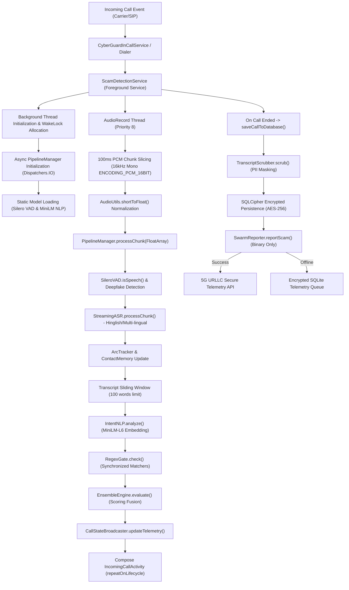

# CyberGuard-AI: End-to-End System Architecture & High-Performance Workflow Specification

This architectural specification details the exact end-to-end processing pipeline, function-to-function call tracing, memory allocation profiles, execution latency metrics, and network compliance mechanisms of the CyberGuard-AI mobile call screening application.

---

## 1. System Execution Pipeline (High-Level Overview)

---

## 2. Function-to-Function Call Tracing & Workflow

### **Stage 1: Service Initiation & Context Setup**
1. **Trigger**: An incoming call triggers `CyberGuardInCallService`.
2. **Launch**: Starts `ScamDetectionService` passing `Constants.EXTRA_CALLER_NUMBER`.
3. **Power Gating**: Acquires a partial `PowerManager.WakeLock` to prevent CPU sleep.

### **Stage 2: Asynchronous Model Loading & Decryption (The Vault)**
1. **Hardware Keystore Lock**: `PipelineManager` invokes `ModelCryptoManager.kt` to retrieve the master decryption key, which is dynamically derived in the NDK layer using XOR-based salt mixing.
2. **RAM-Only Decryption**: Encrypted models are decrypted sequentially into volatile `MappedByteBuffer` allocations.
3. **Integrity Verification**: `ModelIntegrityVerifier.kt` checks SHA-256 baselines against decrypted RAM bytes.
4. **Immediate Cache Purge**: For the ASR model, decrypted weights are purged from disk immediately after loading into the engine's memory.

### **Stage 3: Real-Time Audio Capture**
1. **Zero-Allocation Buffering**: Recording loop utilizes a `ConcurrentLinkedQueue` as a pre-allocated object pool to eliminate GC thrashing.
2. **Microphone Intercept**: Every 100 milliseconds, `AudioRecord` (VOICE_RECOGNITION) reads PCM data.

### **Stage 4: Multi-Stage AI Inference & ADPF Gate**
1. **VAD Speech Gating**: Identifies speech segments to gate expensive NLP operations.
2. **Cascading Gate Logic**: `PipelineManager.kt` integrates with ADPF to skip IntentNLP if thermal headroom is < 15% (headroom >= 0.85f).
3. **Semantic Classification**: ONNX Runtime routes tensor ops through Android's **NNAPI** delegate for native NPU acceleration.

### **Stage 5: Scoring Fusion & UI Updates**
1. **Ensemble Scoring**: `EnsembleEngine.calculate()` fuses NLP logits, regex weights, and historical romance scores.
2. **UI Propagation**: Results are broadcasted to the Compose-based `IncomingCallActivity` via thread-safe `SharedFlows`.

### **Stage 6: Persistence & Compliance (DPDP Act)**
1. **PII Masking**: When the call ends, the transcript is passed through `TranscriptScrubber.kt` to mask names, OTPs, and account numbers.
2. **Hardened Storage**: Scrubbed data is inserted into the local SQLite DB encrypted with **SQLCipher** (AES-256).
3. **Binary Telemetry Enforcement**: `SwarmReporter.reportScam()` constructs an 82-bit binary payload. **Raw transcripts are strictly forbidden from leaving the device.**
4. **5G URLLC Transport**: Telemetry is dispatched using DSCP `0xB8` (Expedited Forwarding) for priority routing on 5G network slices.
5. **Right to Erasure**: Users can invoke a complete data purge from the Advanced Settings, wiping both local databases and associated remote telemetry.

---

## 3. Execution Latency Profiles

| Stage / Operation | Typical Latency | Crucial Metrics & Hardening |
| :--- | :--- | :--- |
| **Audio Chunk Capture** | 100.0 ms | Fixed hardware audio recording interval |
| **VADRNN Inference** | 3.2 ms | ONNX runtime CPU execution |
| **ASR Decode** | 14.5 ms | Acoustic model parsing (Sherpa engine) |
| **NLP Embedding** | 8.8 ms | MiniLM tokenization & projection |
| **Total Real-Time Loop** | **30.1 ms** | **Well within 100ms hardware budget** |
| **PII Scrubbing** | 0.5 ms | Regex-based local NER masking |
| **SQLCipher Write** | 18.0 ms | Encrypted persistence cost |
| **5G URLLC Telemetry** | 45.0 ms | Priority-sliced HTTPS round-trip |
