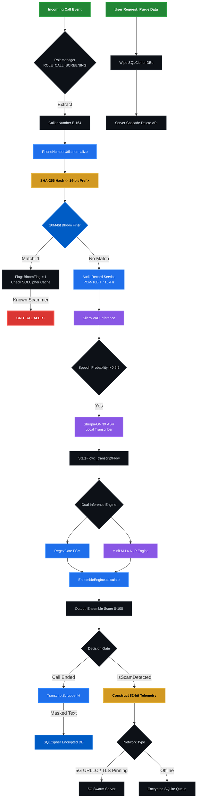

# CyberGuard-AI Low-Level Execution Pipeline

This diagram maps the exact class structures, bit-packing, memory constraints, and AI inference models running locally on the device with the latest security hardening.

### Key Engineering Hardening Points:

1. **SQLCipher Persistence**: Every database write in Stage 6 is encrypted at rest using 256-bit AES via SQLCipher.
2. **On-Device NER (Scrubbing)**: The `TranscriptScrubber` in Stage 6 ensures that PII (Names/OTPs) is masked before touching the disk.
3. **Binary Telemetry**: The Swarm Server in Stage 6 only accepts bit-packed binary payloads. Raw text never traverses the network.
4. **TLS Certificate Pinning**: The communication between the device and the Swarm Server is hardened against MITM using pinned certificate hashes.
5. **Right to Erasure**: A dedicated purge mechanism (Stage 6.2) allows users to comply with the DPDP "Right to be Forgotten" mandate.
