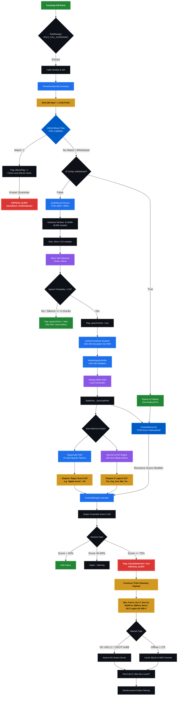

# CyberGuard-AI Low-Level Execution Pipeline

This diagram maps the exact class structures, bit-packing, memory constraints, and AI inference models running locally on the device.

```mermaid
graph TD
    classDef default fill:#0D1117,stroke:#30363D,stroke-width:1px,color:#E6EDF3,font-size:12px;
    classDef startEvent fill:#238636,stroke:#2EA043,stroke-width:2px,color:#FFF,font-weight:bold;
    classDef hardware fill:#1F6FEB,stroke:#388BFD,stroke-width:2px,color:#FFF;
    classDef aiEngine fill:#8957E5,stroke:#A371F7,stroke-width:2px,color:#FFF;
    classDef bitPacking fill:#D29922,stroke:#E3B341,stroke-width:2px,color:#000,font-weight:bold;
    classDef alertRed fill:#DA3633,stroke:#F85149,stroke-width:3px,color:#FFF,font-weight:bold;
    classDef safeGreen fill:#238636,stroke:#2EA043,stroke-width:2px,color:#FFF;
    classDef database fill:#005CC5,stroke:#0366D6,stroke-width:2px,color:#FFF;

    %% 1. Interception & Pre-Screening
    A[Incoming Call Event]:::startEvent --> B{RoleManager<br/>ROLE_CALL_SCREENING}
    B -->|Extract| C[Caller Number E.164]
    
    %% Stage 2: Hardware & Quick Checks
    C --> D[PhoneNumberUtils.normalize]:::hardware
    D --> E[SHA-256 Hash -> 14-bit Prefix]:::bitPacking
    E --> F{10M-bit Bloom Filter<br/>FPR: 0.00009%}:::database
    
    F -->|Match: 1| G[Flag: BloomFlag = 1<br/>Check Local SQLite Cache]
    G -->|Known Scammer| H[CRITICAL ALERT<br/>Auto-Block / UI Red Banner]:::alertRed
    
    F -->|No Match / Whitelisted| I{UI Config: isWhitelisted?}
    
    %% Stage 3: Audio Slicing & VAD
    I -->|False| L[AudioRecord Service<br/>PCM-16BIT / 48kHz]:::hardware
    L --> M[Hardware Window: 3s Buffer<br/>48,000 samples]
    M --> N[Slice: 32ms / 512 samples]
    N --> O[Silero VAD Inference<br/>Chunk: 100ms]:::aiEngine
    
    O --> P{Speech Probability > 0.5f?}
    P -->|No / Silence >= 4 chunks| Q[Flag: speechActive = false<br/>Skip ASR / Save Battery]:::safeGreen
    
    %% Stage 4: Inference (V1.1 Crypto Encrypted)
    P -->|Yes| R[Flag: speechActive = true]
    R --> S[Android Hardware Keystore<br/>AES-256 Decryption into RAM]:::hardware
    S --> SA[ModelIntegrityVerifier<br/>SHA-256 Validation]:::hardware
    SA --> SB[Sherpa-ONNX ASR<br/>Local Transcriber]:::aiEngine
    SB --> T[StateFlow: _transcriptFlow]
    
    T --> U{Dual Inference Engine}
    
    %% Stage 4.1: Deterministic
    U --> V[RegexGate FSM<br/>19 India-Specific Patterns]:::hardware
    V --> W[Outputs: Regex Score 0-63<br/>e.g. 'digital arrest' = 40]:::bitPacking
    
    %% Stage 4.2: Probabilistic
    U --> X[MiniLM-L6 NLP Engine<br/>100-word sliding window]:::aiEngine
    X --> Y[Outputs 5 Logits 0-127:<br/>Fin, Urg, Coe, Mal, Tru]:::bitPacking
    
    %% Pig Butchering
    I -->|True| J[Bypass AI Pipeline<br/>Save Battery/CPU]:::safeGreen
    J --> K[ContactMemory.kt<br/>72-Bit Struct / Byte-packed]:::database
    T --> K
    
    %% Stage 5: Fusion
    W --> Z[EnsembleEngine.calculate]:::hardware
    Y --> Z
    K -->|Romance Score Modifier| Z
    
    Z --> AA[Output: Ensemble Score 0-100]
    AA --> AB{Decision Gate}
    
    AB -->|Score < 40%| AC[Safe Status]:::safeGreen
    AB -->|Score 40-69%| AD[Haptic + Warning]
    AB -->|Score >= 70%| AE[Flag: isScamDetected = true<br/>CRITICAL ALERT]:::alertRed
    
    %% Stage 6: Telemetry & Swarm
    AE --> AF[Construct 75-bit Telemetry Payload]:::bitPacking
    AF --> AG[Bits: Fmt=3, Scr=7, Dur=14,<br/>RSRP=6, SINR=6, Net=3,<br/>NLP Logits=35, Blk=1]:::bitPacking
    
    AG --> AH{Network Type}
    AH -->|5G URLLC / DSCP 0xB8| AI[Send to 5G Swarm Server]
    AH -->|Offline / LTE| AJ[Cache SQLite & SMS Transmit]
    
    %% Post Call
    AI --> AK[Post-Call UI: Was this a scam?]
    AJ --> AK
    AK --> AL[Reinforcement Outlier Filtering]
```
