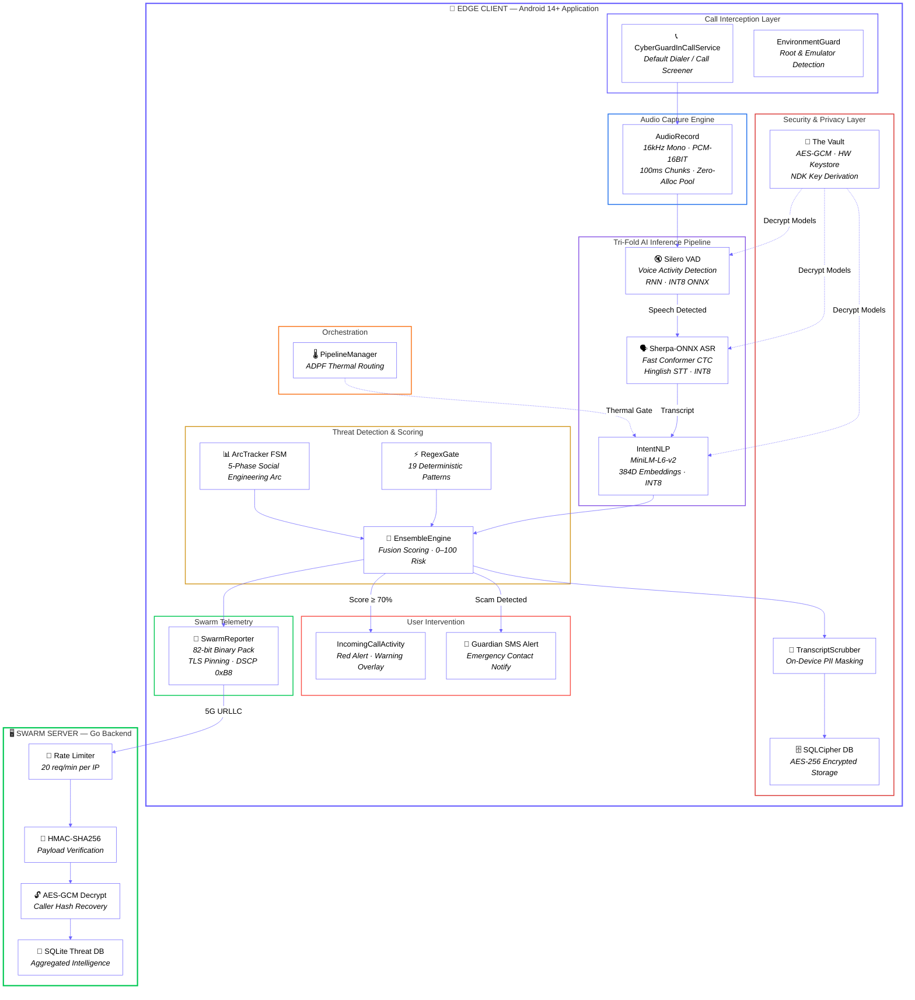
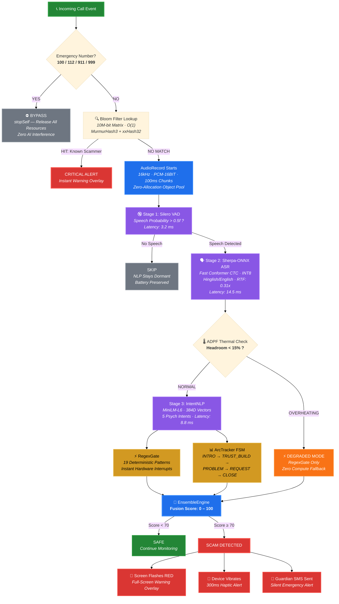
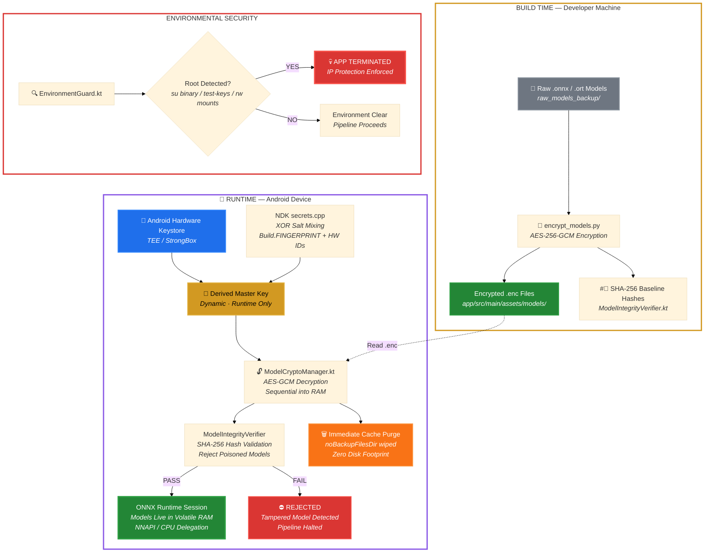
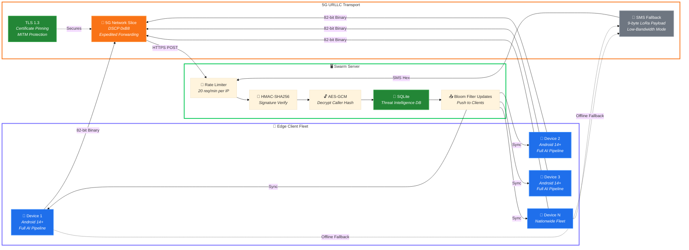
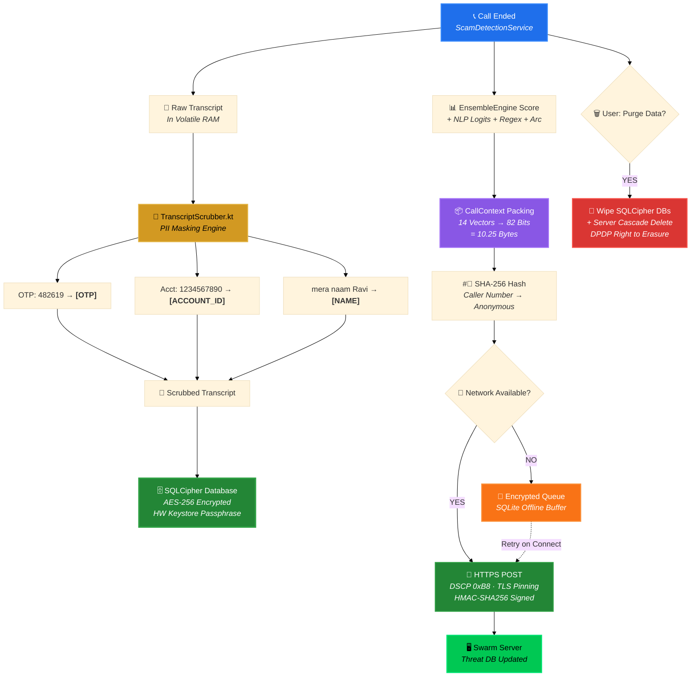
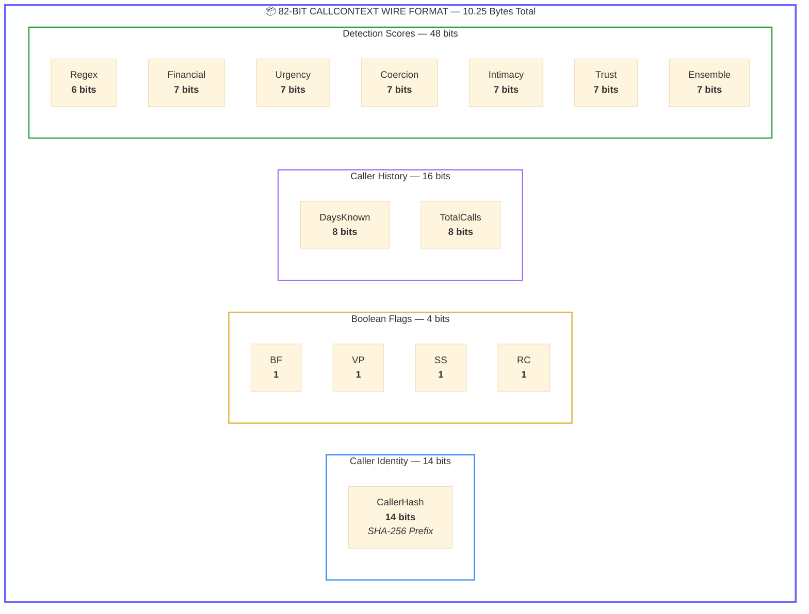

# CyberGuard AI — Architecture Diagrams (Mermaid Code)

> **Rendering Instructions:** Paste each code block into [Mermaid Live Editor](https://mermaid.live), export as **SVG** or **PNG (2x scale)**, and place on the A4 page. All diagrams use large fonts, short labels, and thick strokes for print readability.

---

## Diagram 1: High-Level System Architecture

> Replaces: `[INSERT: Structural Blueprint/Diagram]` in §5.1

---

## Diagram 2: Edge AI Inference Pipeline (Detailed)

> Use for: `[INSERT: Integration Phase Photo/Screenshot]` locations in §5.2

---

## Diagram 3: Security & Encryption Architecture ("The Vault")

> Use for: `[INSERT: Integration Phase Photo/Screenshot — Encryption pipeline]` in §5.2 Step 8

---

## Diagram 4: Network Deployment Architecture

> Replaces: `[INSERT: Network Architecture Diagram]` in §6.1

---

## Diagram 5: End-to-End Call Data Flow (Post-Call Persistence)

> Use for: Data Flow tracing in §6.2

---

## Diagram 6: 82-Bit Telemetry Wire Format (CallContext)

> Use for: Binary telemetry visualization in §6.2 or §4

> **Flag Legend:** BF = Bloom Filter Hit, VP = VoIP Flag, SS = STIR/SHAKEN Fail, RC = Repeated Caller
> **Total:** 14 + 4 + 16 + 48 = **82 bits (10.25 bytes)**

---

## Rendering Tips for A4 Print

| Setting | Recommendation |
|:---|:---|
| **Export Format** | SVG preferred (scales perfectly), or PNG at **2x / 3x scale** |
| **Page Orientation** | Diagrams 1, 2, 3, 5 → **Portrait**. Diagram 4, 6 → **Landscape** |
| **Mermaid Live Editor** | Paste code at [mermaid.live](https://mermaid.live) → Actions → Export PNG (2048px width) |
| **Background** | Set to **white** for print, or keep dark for digital submission |
| **Font Override** | If text appears small, increase `fontSize` in the `%%{init}%%` header (e.g., `20px`) |
